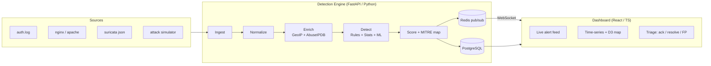

# Argus — The Intrusion Detection System

> Argus Panoptes, the all-seeing hundred-eyed guardian of Greek myth — a fitting name for a system whose job is to watch everything and miss nothing.

Argus is a real-time intrusion-detection platform: it ingests real log data, runs it through a layered detection engine (signature rules + statistical anomaly detection + machine learning), maps findings to the **MITRE ATT&CK** framework, enriches source IPs with geolocation and threat-intel, and streams scored alerts to a live analyst dashboard.

[](https://github.com/USERNAME/argus-ids/actions/workflows/ci.yml)

---

## Origin — this is a ground-up rebuild

Argus began life as a 3rd-semester **DBMS Laboratory mini-project** (*"Intrusion Detection System"*, Oct 2024) by **Muskan Gupta**. That original version — preserved verbatim under [`docs/legacy/`](docs/legacy/) — was a learning prototype: detection was a handful of hard-coded line-count heuristics running in browser JavaScript, the PHP/MySQL backend was never actually wired to the frontend, "authentication" only toggled a `<div>`, and every database query was vulnerable to SQL injection.

**Argus is a complete rebuild**, not a patch. It keeps the original's *intent* — detect common network attacks, explain them, visualize them — and delivers it properly: a connected pipeline, a real detection engine, secure-by-default code, and the features the original report only claimed. See [`docs/legacy/README.md`](docs/legacy/README.md) for the full before/after.

---

## Architecture



## Tech stack

| Layer | Technology |
|---|---|
| Detection + API | Python 3.12+, FastAPI, Pydantic v2 |
| Database | PostgreSQL 16, SQLAlchemy 2.0, Alembic |
| Cache / real-time | Redis (rate-limit windows, alert pub/sub) |
| Auth | OAuth2 + JWT, Argon2id hashing, RBAC |
| ML / stats | scikit-learn (Isolation Forest), sliding-window + z-score |
| Detection content | Sigma-style YAML rules, MITRE ATT&CK mapping |
| Enrichment | MaxMind GeoLite2, AbuseIPDB |
| Frontend | React, TypeScript, Vite, Tailwind, Chart.js + D3 |
| Quality / DevOps | pytest, ruff, mypy, Docker, GitHub Actions |

## Quickstart

```bash
# 1. Bring up Postgres + Redis + the API
cp .env.example .env
docker compose up --build

# API:        http://localhost:8000
# Swagger UI: http://localhost:8000/docs
# Health:     http://localhost:8000/api/health
```

Local backend dev (without Docker):

```bash
cd backend
python -m venv .venv && .venv\Scripts\activate   # Windows
pip install -e ".[dev]"

alembic upgrade head                                  # create the schema
python -m app.cli sync-rules                           # load detection rules
python -m app.cli create-admin \                      # seed the first admin
    --username admin --email admin@argus.local --password 'change-me-123'

uvicorn app.main:app --reload
pytest -q
```

Frontend dashboard (in a second terminal):

```bash
cd frontend
npm install
npm run dev        # http://localhost:5173 — sign in with the admin you created
```

## API (M1)

Interactive docs live at `/docs`. Authentication is OAuth2 password flow →
JWT bearer token; access is gated by the role hierarchy **viewer < analyst < admin**.

| Method | Path | Role | Purpose |
|---|---|---|---|
| `POST` | `/api/auth/register` | public | Self-register (always created as `viewer`) |
| `POST` | `/api/auth/login` | public | Exchange credentials for a JWT |
| `GET`  | `/api/auth/me` | any | Current user profile |
| `GET`/`POST` | `/api/users` | admin | List / create users with an explicit role |
| `PATCH` | `/api/users/{id}/role` | admin | Change another user's role |
| `POST` | `/api/ingest` | analyst | Ingest a JSON batch of raw log lines |
| `POST` | `/api/ingest/file` | analyst | Ingest an uploaded log file |
| `GET`  | `/api/alerts` | any | List alerts (filter by status/severity/source IP) |
| `GET`  | `/api/alerts/{id}` | any | Inspect a single alert |
| `PATCH`| `/api/alerts/{id}/status` | analyst | Triage: acknowledge / resolve / false-positive |

Ingestion parses real log formats — Linux `auth.log`, nginx/Apache combined
access logs, and Suricata EVE JSON — into normalized, indexed events.
Passwords are Argon2id-hashed and every query is parameterized: the SQL
injection and fake auth of the [original project](docs/legacy/) are gone.

## Detection (M2)

Detection is **data, not code**: rules live as Sigma-style YAML files in
[`backend/app/detection/rules/`](backend/app/detection/rules/), not as
hard-coded `if` statements. Each rule maps to a [MITRE ATT&CK](https://attack.mitre.org/)
technique and a severity. Two rule shapes cover the original project's three
attack types plus brute force:

| Rule | Type | MITRE | Fires when |
|---|---|---|---|
| SSH brute force | threshold | T1110 | ≥5 failed SSH auths from one IP in 60s |
| HTTP flood / DoS | threshold | T1498 | ≥100 HTTP requests from one IP in 10s |
| Port scan | threshold (distinct) | T1046 | one IP hits ≥10 distinct ports in 60s |
| SQL injection probe | match | T1190 | a request path matches SQLi signatures |

On ingest, the engine evaluates every enabled rule over the new events and
persists scored alerts (deduplicated so detections don't storm the queue).
Analysts then move each alert through its lifecycle — *open → acknowledged →
resolved / false-positive* — via the triage endpoint.

## Repository layout

```
argus-ids/
├── backend/            FastAPI app, detection engine, models, tests
│   ├── app/
│   │   ├── api/        routes (auth, users, ingest) + deps (auth/RBAC)
│   │   ├── core/       config, security (JWT/Argon2)
│   │   ├── crud/       data-access layer (parameterized queries)
│   │   ├── db/         SQLAlchemy engine, session, portable types
│   │   ├── models/     database models
│   │   ├── schemas/    Pydantic request/response models
│   │   ├── detection/  rule engine (rules/*.yml) + MITRE; anomaly/ML at M5
│   │   ├── ingest/     parsers (auth.log, nginx, suricata) + service
│   │   ├── enrich/     GeoIP + threat-intel             (M4)
│   │   └── cli.py      admin bootstrap (create-admin)
│   ├── alembic/        database migrations
│   └── tests/          pytest suite (SQLite-backed)
├── frontend/           React + TS dashboard            (built at M3)
├── simulator/          attack-replay harness           (built at M6)
├── data/samples/       sample logs (auth / nginx / suricata)
├── docs/legacy/        the original college project, preserved
└── .github/workflows/  CI (lint, type-check, migrate, test)
```

## Roadmap

- [x] **M0 — Scaffold:** repo, Docker, CI, data model, runnable API
- [x] **M1 — Secure core:** ingest API + parsers, Argon2 auth + RBAC, parameterized everything, migration
- [x] **M2 — Rule engine:** Sigma-style YAML rules (DoS / brute-force / port-scan / SQLi), MITRE mapping, persisted alerts + triage
- [x] **M3 — Dashboard:** React + TS UI — login, stat cards, severity/timeline charts, filterable alert table, inline triage
- [ ] **M4 — Real-time + enrichment:** WebSocket feed, GeoIP / AbuseIPDB, D3 attack map
- [ ] **M5 — Intelligence:** statistical + ML anomaly detection, MITRE ATT&CK mapping, severity scoring
- [ ] **M6 — Demo polish:** attack-replay harness, false-positive tuning loop, demo GIF

## License

MIT © 2026 Muskan Gupta — see [LICENSE](LICENSE).
